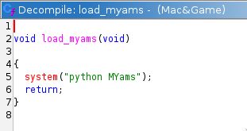

Le fichier est un code python obfusqué, quand on essaie de l'exécuter sans passer par Mac&Games ça  ne fait rien. On va l'analyse en le déobfusquant car la seule chose que Mac&Games fait pour le lancer est de l'exécuter avec python :



La technique la plus rapide pour déobfusquer du code python ou javascript est d'exécuter les partie qui sont censées donner des String. On va commencé par ça en exécutant le code suivant (tiré du fichier du challenge) :

```python
import codecs
import base64
print(base64.b32decode(codecs.decode('ASJKN33FBDDTRLYGZH3QVPGWAILT64GHROLUT5YHASJNH2YABOKKR5ONA5MDH2YABOKKR5ONBA4KTPF7Y4DQ2VQUZI2TP5QHBVHS6K3WAILT64GHY5CFDW3CBZGFFYONR5GJX5QDBOHJVWMWSNHDH4ONUHDS6K3WAILT64GHY5CFDW3DBA2KV2YZR4HF4HQFA5EJX43GSOCI6XVXALDQ2VQUZI2TP5QHBVHUNYONR4GF42GCASKPDJ3QAOMPD33FZDHTTXWWROGT64ENZZDTF3ENR5KTP3YSR5BFFXWVSRSTFMENR4GF42GCASKPDJ3QAOMPD6OWROGT64ENCNDTF3ENYZ3GBYONUR3FLVOMURJPNZMLSDDQBZWZRN4GBYONTRLQFYONTRLQPKX5SRDPPCWNAL5NHVONRNDS6K3WAILT64GHY5CFDW3GCSMFBXWBZI4TF5OVTNHDHMYLZIEFDLGOBAFGZAOBZV3QVMQSZAKJVMWVZVGJPIMEB5EQTFEDWSRRH2QPAIWUZLFEBOJJT3WMBERHBGGJZWQKD3PMTAWUNLEFTI5RFE3ZBEEHBBYMZEOHREQPTAYUXMPUXM4HT3YZBEEHBBYMZEOHR53QTAYQNLXKB5SJPIMEB5EQTFEDWSQGF6FQAIJUVL2UUS4JVD2PCWFIDGXYVAJIR3P2ASOTZBPXTWWKXD3UBOUJB33UWSOHPM2LTR4TBHPGVWKSHJPFAOFRDHGMWAQQFMGOX4LKBLEGWVLSDZWLA5SQRBY2WW4JJ42WVAFT4JFLXW3JTE3ZAASUF23CWAVJ6M2WVANJBL2QVR4HFEEMZMDIBZYKZVMHHZPLTR4T6FEGVW5TVJPFBOERTL3DWEJRR6YPTWUTLLMGWIKIDZWLBOOJFDYUWSOHR5XWVDLTBJEFXLLSFJPFTOEJF2QKWEOHP3FXCR2KPLEFAE2HJEGHAWDHDFYCZVMHH22YV5TKNF2GVWJJRZ2WZ5ZKFDGDZWHHP3GPAIQUVJFGZEFRJH3YA5SIP33UWSOHPM3OX5ZJBFGMZA2JP3WMBOETF2QPYRMTD6XYWOGKNFXUYW3TT2XPTERHB3QIWSQUTZ2BCS3JBG2HZAMHFEQYTITRTDY2W5OKBM2BCWPKTFXRAZMHLD2OCOTHV23GWSPRX52AXLLJVF2GVSHSNH2PBIUJB33UWSOHPM2WVANJBFXTUSGTPIMEB5EQTFEDYNLGD32XTAUQXL3MZALRL3XJTEDIDHYCWIOJJF2QAIJUVL2UUS4JVD2PCSZIBAYYZVMQNF2QAAWRZIWEUSOSX3PEZ5VSTDEKVAHHPM2WVANKDG3WVSKHT2XOZ5RHTDYUWSOHPM2WBISIX2FCWAXJBG2YXIGH6F2IZ5UHJIYUW5SIXM2CWAXJBG2YXIGH6F2IAAOHF42QASNJBFXQVSGHFD2OZ5RKXF2IZ5HHPM2WVANJBFXQVEHJLFXWASTRP33UWSOHPM2WVANJBFXQWEHJLFXWZ5RHTEQWAD2QDM2WVAPTF3PWWSHHLDYCZ5RHTDYUWSOHPM2WVATTF3PWWSGHFD2OZ5RHTDYUTELSTD2WAS3HJFXQVSGHFD2OZ5RHTDYWTELSTIWHBOWHPAQDXANGV4PGVR2UNH2OTELSTDWHBOWHPAQDXANGV4PGYSRJB33UWSOHPM2YXA3HJFXQVSGHFEPWTMRHTM2YWSOHPM2WVANJBFXQVSHGV4PGWH2UNH2OTELSTDWHBOWHPAQDXANGV4PGVR2UNH2OTELSTDWHBOWIPFYWB5SHFD2OZ5RHTDYUWSOHP2WHBOWHTFXQVEHJLAOLZ5RHTDYUTELSTD2WAS3HJFXQVSGHFD2OZ5RHTDYWTELSTD2WVANJBFXQVSGHFG2YXIGJFFYGVAHHPM2WVANJBFXQVSGHF5XYXIGJFDYUWSOHV2YZTD4TBFXCWAXJB2XWBAOJFDYUWSOHPM2WVANJBFYIWAXJLG2YXIGH6F2IZ5UHJIYUW5SIXM2CWAXJBG2YXIGH6F2IZ5UHJIYAVARHJFXQVSGHFD3YBAOJFDYUWSOHP6FCASNJ6D3WVSGHFD2OZ5RHTDYUWS2HJIYXW5SIXM2CWAXJBG2YXIGH6F2IZ5UHJIYUW5SIXM2CWAXJBG2YXIIHTFYGVAHHPM2WVANJBFXQVSGHF5XYXIGJFDYUTELTXHPWVANJBFXCWAXJB2XWBAOJFDYUWSOHPM2WVANJBFYIWAXJB2XOZ5RH6F2LAW4HPM2WW5SIXM3WWSMHT2XOZ5RHTDYUWSOHPM2WBISIXM3WVSGHFD2RASJQVBQUWSUHJIYUASRKTD3WVSGHFD2OZ5RHTDYUWS2HJIYZW5SIXM2CWAXJBG2YXIGH6F2IZ5UHJIYUW5SIXM2CWAXJBG2YXIJHTFXYWSOHPM2WVAIKTD3WVSGHFD2OTOUJFDYCVAHHPM2WVANJBFXQVSGHF5XYXIIR6F2IZ5UHJIYUW5SIXM2CWAXJBG2YXIGH6F2IZ5UHJIYUW5SIX22QWSMHT2XOZ5RHTDYUWSOHPM2WBISIXM3WVSGGV4QSXORH6F2LAW4HPMMHBOWHTFYWB5SHFD2OZ5RHTDYUWSOHP2WHBOWHTFXQVSGHFD2OZ5RH6F2IZ5HHF42QASNJBFXQVSGHFD2OZ5RKXF2IZ5HHPMMHBOFINFXCWAZTH6XOZ42UNH2QWSHKBF2WVANJBFXQVSGHFD2OAR2UNH2ITELSTDWHBOWHPAQDXANGV4PGVR2UNH2OTELSTDWHBOWHPAQDXAZHFM3CZ5RHTDYUWAWKBF2WVANJBFXRXH3RFD3UWARHTDYUWSOHPM2WVANJFAQDXATGV4PGVR2UNH2OTELSTDWHBOWHPAQDXANGV4PGVR2UNH2OTELSTHXWAS3HJFXQVSGHFD2OZ5RHTDYWTELSTD2WVAPTF3OHUOGGV4QSXORHTEQWAERHF2XZVSKJBFXQVSGHFD2OZ5RHTGQWAERHFM2WVAPTF3OHUOGHFD2RASJRFFYWWENJ6M2WVANJBFXQVSGHFD2ZASJRFFYUWSUHJJQXCSPTF3OHUOGHFG2YXIGJFFYGVAHHPM2WVANJBFXQVSGHF5XYXIJR6F2IZ5UHJIYUW5SIXM2CWAXJBG2YXIGH6F2IZ5UHJIYUW5SIX3XQWSSHFD2OZ5RHT23GVAHHPM2WVANGRG3WVSKHT2XOZ5RHTDYUWSOHPM2WBISIX2FCWAXJBG2YXIGH6F2IZ5UHJIYUW5SIXM2CWAXJBG2YXIGH6F2IAAOHF42QASNJBFXQVSGHFD2OZ5RKXF2IZ5HHPMMHBOFINFXCWAZTH6XOZ42UNH2QWSHKBF2WVANJBFXQVSGHFD2OAR2UNH2QWSOHV2YZTD4TBAQDZIVRFD2RASJRFFYWWENJ6M2WVANJBFXQVSGHFD2ZASJRFFYUWSUHJJQXCSPTF3OHUOGHFG2YXIGJFFYGVAHHPM2WVANJBFXQVSGHF5XYXIJR6F2IZ5UHJIYUW5SIXM2CWAXJBG2YXIGH6F2IZ5UHJIYUW5SIX3XQWSSHFD2OZ5RHT22YZMVJ62FWV5AUTJXKZZ3RFEPTZMTIVDEFWHLGFFPBVHLJLL3KBOIIHI2MZ5ERBEGIYRMSZ6XLTWWTLF2QAZ3RT2XOZ5RHTDGMYWZSRZYQAH2TBL3AVM2IHEMMBETT4FGVZWJIR4QPAMVJ6GXGB5GH42YYWAOJ2HGZYWHHR2P2AIAUNJWFAOJTT3OMAAAST2QYWIWKBM22VERKNG3UA5GHFD2OZ5ZIDFEDWIWHPBXWVIWRZIWEUSOSX3PFZWARVEGRVAHHPM2WVAOTDL3BXS4HFEODZ5WRXIFHYNLRZH2JVM2TJGYZTOSHFD2OZ5RHBJGJZAHHR43OX5FUXJFHVIMHFE3LBOAQRAYZWIHHR4QPASOQZLXLVSKIFJPXTOTIT53UYSZRHZPAASIGZD3WVSGHFD2OZ5RHTDYUZARRH4QPAMVJ6JGWWV3JRE3ZAMET2IYLZMWHPM3STW4UNJEFTIJR23EDASSIP32YYWQIZ3XWV4LJDLXKTEKHJIQCWARHTDYUWSQGF6FZAMUQXLMGXWJTRH3UASZGR6QZYSZRF2XYXSKJBFXQVSGJTFPXBOET4HYCWVLKD5XXVAWTTJPQVSGHFD2OZ5RHTHYYYOQUBM2XVAWTTJPQVSGHFD2OZ5SRTHGQYOOJT4PWVANJBFXQVSGHFD2OZ5RHTDYUWSOHPM2WVANJBFXQVSGHFD2OZ5RHTDYUWSOHPM2WVANJBD3WVSGHFD2PB5EJ23QIZEOJB3FXVAVJJJPTB5GHFD2OZ5SRTHYYWSRUDL2LVAVJJJPTB5GHFD2OAASRTDYUZMOHPM2WVANJBFXQVSGHFD2OZ5RHTDYUWSOHPM2WVANJBFXQVSGHFD2OZ5RHTDYUWSOHPM2XCSIHJFXQVSGHFFPPCSDIBAWDWAOJT22XVAVJJJPTB5GHFD2EAASRTHYUZMOHRL2LVAVJJJPTB5GHHD2EZ5RHTBQYWWOIP22XVAWTTJPQVSGHHD2EAASRTHYYYOQUB22XVAVJJJPTB5GHFD2OAASRTHYYWWOIP22LVM3JBFGMAASHFD2OZ5RHDDGMZSYGXZPYVAEJJFFTCOEHHD2FZAZRTHYYWSOIP22WWO3JBFXTCOEHHD2EAASRTDYUWE4HRL2LVL4JZJOEUOIHHEGLZARHTHYYWSOHRMFXVAVJBFXTUOIHHEGLZARHTHYYWSOHRMFLTR4JZJOGB5KRJHYCZ5RHTDYUZARRH4QPAMVJ6FGMXSIHFEGLZASRTHYYWSOHP22XVAOQDFXQVSGIDEGKAASRTDYUWE4HPM2XVAVJJFFQXSIHHD2PUOSRTHYUWE4HP22XVANKZFXQXSIHFFQLZAZRTHYYWWOIP22XVM4TTFXQVSKRJHYCZ5RHTDYUZARRH4QPAMVJ6FGMXSIHFFQLZAZRTHYUWSOGD22XVAOQDFXQVSGHFD2EAARHD53UWSOIP22WVAOTZJQMXSIHFFQKAASRTDELWSOIP22WWO3JBFFQXSGJZD2PZAZRZBYTYNLGD22XVM4TTFXQZALRT2XOZ5RHTDGKZAJJL5YRVAGJ4FFQXSGJZD2PZAZRZBQJWSOIP22WWO3JBFXQVSGHHD2EZ5GRTDYUYOQUB22XVAVJJFFQXSIHFFQKAASRTDELWSOIP22WWO3JBFFQXSGJZD2EAASRTHYYWWOIPM2WWO3J4F2EA5GHFD2OZ5EHDFGDZWKSP32XTS4TTJOEUR4RFD2OZ5RHTDGQYOQQFMGTVANJBFXQVWEIDEEMZMGRTDYUWSQUDL2LTR4JZJOEUSGSDZ3LZAZRZBYTZMOHRL2LVL4JZMFQVWEIDEEMZMGRZ6QQYNLGFMFLTR4JZJQMUOGIDEMHAMSIP33UWSOHPM3QWOSUNLGBXSKHF23LAOFSBAYXZSQJL5X2CSOTJLXKWMJTT6WHBITTL6QIWSHJJF2WVANJBFXUXS4RFEODZ5ERBEGIYRMSZ6XLTWWTLF2QAASHFD2OZ5RHBHYMWSPQNM3PV5QUXJWFXM4IDZFFAESHT22YWSOHPM2WV5QT2JGAAEITPE2JCSZQRHGZWAQIP6PZVAOTJGYWAASHT2XOZ5RHTDGKZAJJL5YRVAHT2FYZCO2IX3XJCWFSB6ODZA4HPAFWWO2TJGXLTOGIFIMIAARHD5QYWIKQN2XYXSKJBFXQVSGJPI2MZ5ARVEYUXOXQNM2BASOTDLGAXSGIHEPWZ5VSVZQUWMIT6F2WVANJBFXQVSGHFD2PB5EJ23QIZEOJB2XJTWJUXFXQVIHHJHYCZ5RHTDYUYWYKD6F2XEKHJFXQVSGHFD2OZ5RHTDGKZAJJL5YRVAGJFI2KURLHFE3LBMEGRIYGWSRSR6YSXAOTDJEFVMLTR2XOAORJF22YWSOHPM2WWOSTLLYAURLIHJPWZ5VSTDGDZWKRRZYRVAGJFJPUTIPJR6XPTIEQTIYUZDMRZ5YRVAOQNLGMVW3JRE2TTIRHBEGBYSYJL5XWVD4TBF2VAA3TR2YYZ5UJFDYWWAWGX43PTAFTLL3WZ5LRT2XOZ5RHTDGDYWHHR6X2X5LUZMPKXM4HFD2SUSRHTFEIWSIT6F2WVANJBFXQVSGHFD2PB5EJ23QIZEOJB2XJV5HTDLGABAGJXIMMTSRHBJGJZAHHR53PV5QQXLXKTIKRFD2SASSIP33UWSOHPM2WVANJBFXUXL2TPJPEA5THT22YVAGJ6F3OX5ZJBJOEUS2IFIMEAEZQPBQUXOXQNM2WAD4JZLFKVMLTR3OMZMRJH32YWSOHPM2WVLKKB3F2WZ2RJD3YWARHTDYUWSRTV33OX54TLFXTXW4JVI2ITMOJFDYUWSOHPM2WVANJBLFKVMLTR2YUBOOJBCW5R4HF4MQSZAKJVMWVSRHD====', 'rot_13')).decode())
```

On décode enore une fois ce que l'on obtient :

```python
import base64
print(base64.b64decode(b'aW1wb3J0IHJhbmRvbQpmcm9tIGNvbGxlY3Rpb25zIGltcG9ydCBDb3VudGVyCmltcG9ydCBwc3V0aWwKaW1wb3J0IG9zCmltcG9ydCBzeXMKCmRlZiBf8J2SuCgpOgogICAgX18gPSBnZXRhdHRyKF9faW1wb3J0X18oJ29zJyksICdnZXRwcGlkJykoKQogICAgcCA9IF9faW1wb3J0X18oJ3BzdXRpbCcpLlByb2Nlc3MoX18pCiAgICBuID0gZ2V0YXR0cihwLCAnJy5qb2luKFtjaHIob3JkKGMpKSBmb3IgYyBpbiAnbmFtZSddKSkoKQogICAgaWYgJycuam9pbihbY2hyKHgpIGZvciB4IGluIFs3NywgOTcsIDk5LCAzOCwgNzEsIDk3LCAxMDksIDEwMV1dKSAhPSBuOgogICAgICAgIF9faW1wb3J0X18oJ3N5cycpLmV4aXQoMCkKCmltcG9ydCByYW5kb20KCkRFU19BUlQgPSB7CiAgICAxOiAoCiAgICAgICAgIuKUjOKUgOKUgOKUgOKUgOKUgOKUgOKUgOKUkCIsCiAgICAgICAgIuKUgiAgICAgICDilIIiLAogICAgICAgICLilIIgICDil48gICDilIIiLAogICAgICAgICLilIIgICAgICAg4pSCIiwKICAgICAgICAi4pSU4pSA4pSA4pSA4pSA4pSA4pSA4pSA4pSYIgogICAgKSwKICAgIDI6ICgKICAgICAgICAi4pSM4pSA4pSA4pSA4pSA4pSA4pSA4pSA4pSQIiwKICAgICAgICAi4pSCICDil48gICAg4pSCIiwKICAgICAgICAi4pSCICAgICAgIOKUgiIsCiAgICAgICAgIuKUgiAgICDil48gIOKUgiIsCiAgICAgICAgIuKUlOKUgOKUgOKUgOKUgOKUgOKUgOKUgOKUmCIKICAgICksCiAgICAzOiAoCiAgICAgICAgIuKUjOKUgOKUgOKUgOKUgOKUgOKUgOKUgOKUkCIsCiAgICAgICAgIuKUgiAg4pePICAgIOKUgiIsCiAgICAgICAgIuKUgiAgIOKXjyAgIOKUgiIsCiAgICAgICAgIuKUgiAgICDil48gIOKUgiIsCiAgICAgICAgIuKUlOKUgOKUgOKUgOKUgOKUgOKUgOKUgOKUmCIKICAgICksCiAgICA0OiAoCiAgICAgICAgIuKUjOKUgOKUgOKUgOKUgOKUgOKUgOKUgOKUkCIsCiAgICAgICAgIuKUgiAg4pePIOKXjyAg4pSCIiwKICAgICAgICAi4pSCICAgICAgIOKUgiIsCiAgICAgICAgIuKUgiAg4pePIOKXjyAg4pSCIiwKICAgICAgICAi4pSU4pSA4pSA4pSA4pSA4pSA4pSA4pSA4pSYIgogICAgKSwKICAgIDU6ICgKICAgICAgICAi4pSM4pSA4pSA4pSA4pSA4pSA4pSA4pSA4pSQIiwKICAgICAgICAi4pSCICDil48g4pePICDilIIiLAogICAgICAgICLilIIgICDil48gICDilIIiLAogICAgICAgICLilIIgIOKXjyDil48gIOKUgiIsCiAgICAgICAgIuKUlOKUgOKUgOKUgOKUgOKUgOKUgOKUgOKUmCIKICAgICksCiAgICA2OiAoCiAgICAgICAgIuKUjOKUgOKUgOKUgOKUgOKUgOKUgOKUgOKUkCIsCiAgICAgICAgIuKUgiAg4pePIOKXjyAg4pSCIiwKICAgICAgICAi4pSCICDil48g4pePICDilIIiLAogICAgICAgICLilIIgIOKXjyDil48gIOKUgiIsCiAgICAgICAgIuKUlOKUgOKUgOKUgOKUgOKUgOKUgOKUgOKUmCIKICAgICkKfQojIGZsYWc6IDFfMTB2M19HNE1lcwpkZWYgbGFuY2VyX2RlKCk6CiAgICByZXR1cm4gcmFuZG9tLnJhbmRpbnQoMSwgNikKCmRlZiBhZmZpY2hlcl9kZShkMSwgZDIpOgogICAgYXJ0MSA9IERFU19BUlRbZDFdCiAgICBhcnQyID0gREVTX0FSVFtkMl0KICAgIGZvciBsaWduZTEsIGxpZ25lMiBpbiB6aXAoYXJ0MSwgYXJ0Mik6CiAgICAgICAgcHJpbnQoZiJ7bGlnbmUxfSAge2xpZ25lMn0iKQoKZGVmIG1haW4oKToKICAgIG9zLnN5c3RlbSgiY2xlYXIiKQogICAgcHJpbnQoJ1xuJCRcXCAgICAgICQkXFwgJCRcXCAgICAgJCRcXCcpICAgICAgICAgICAgICAgICAgICAgICAgICAgICAgICAgCiAgICBwcmludCgnJCQkXFwgICAgJCQkIHxcXCQkXFwgICAkJCAgfCAgICAgICAgICAgICAgICAgICAgICAgICAgICAgICAgJykKICAgIHByaW50KCckJCQkXFwgICQkJCQgfCBcXCQkXFwgJCQgIC8kJCQkJCRcXCAgJCQkJCQkXFwkJCQkXFwgICAkJCQkJCQkXFwgJykKICAgIHByaW50KCckJFxcJCRcXCQkICQkIHwgIFxcJCQkJCAgLyBcXF9fX18kJFxcICQkICBfJCQgIF8kJFxcICQkICBfX19fX3wnKQogICAgcHJpbnQoJyQkIFxcJCQkICAkJCB8ICAgXFwkJCAgLyAgJCQkJCQkJCB8JCQgLyAkJCAvICQkIHxcXCQkJCQkJFxcICAnKQogICAgcHJpbnQoJyQkIHxcXCQgIC8kJCB8ICAgICQkIHwgICQkICBfXyQkIHwkJCB8ICQkIHwgJCQgfCBcXF9fX18kJFxcICcpCiAgICBwcmludCgnJCQgfCBcXF8vICQkIHwgICAgJCQgfCAgXFwkJCQkJCQkIHwkJCB8ICQkIHwgJCQgfCQkJCQkJCQgIHwnKQogICAgcHJpbnQoJ1xcX198ICAgICBcXF9ffCAgICBcXF9ffCAgIFxcX19fX19fX3xcXF9ffCBcXF9ffCBcXF9ffFxcX19fX19fXy8gXG4nKQogICAgcHJpbnQoIkxhdW5jaGluZyBkaWNlcy4uLlxuIikKICAgIGQxID0gbGFuY2VyX2RlKCkKICAgIGQyID0gbGFuY2VyX2RlKCkKICAgIGFmZmljaGVyX2RlKGQxLCBkMikKCiAgICBwcmludChmIlxuUmVzdWx0cyA6IHtkMX0gYW5kIHtkMn0iKQogICAgaWYgZDEgPT0gNiBhbmQgZDIgPT0gNjoKICAgICAgICBwcmludCgiV2luICEiKQogICAgZWxzZToKICAgICAgICBwcmludCgiWW91IGxvc2UsIHRyeSBhZ2FpbiAhIikKICAgIHJlam91ZXIgPSBpbnB1dCgiXG5EbyB5b3Ugd2FudCB0byBwbGF5IGFnYWluID8gKHkvbikgOiAiKS5sb3dlcigpCiAgICBpZiByZWpvdWVyICE9ICJ5IjoKICAgICAgICBwcmludCgiVGhhbmsgeW91IGZvciBwbGF5aW5nICEiKQogICAgICAgIGV4aXQoMCkKCgoKaWYgX19uYW1lX18gPT0gIl9fbWFpbl9fIjoKICAgIF/wnZK4KCkKICAgIHdoaWxlIFRydWU6CiAgICAgICAgbWFpbigpCg==').decode())
```

On a le jeu décodé :

```python
import random
from collections import Counter
import psutil
import os
import sys

def _𝒸():
    __ = getattr(__import__('os'), 'getppid')()
    p = __import__('psutil').Process(__)
    n = getattr(p, ''.join([chr(ord(c)) for c in 'name']))()
    if ''.join([chr(x) for x in [77, 97, 99, 38, 71, 97, 109, 101]]) != n:
        __import__('sys').exit(0)

import random

DES_ART = {
    1: (
        "┌───────┐",
        "│       │",
        "│   ●   │",
        "│       │",
        "└───────┘"
    ),
    2: (
        "┌───────┐",
        "│  ●    │",
        "│       │",
        "│    ●  │",
        "└───────┘"
    ),
    3: (
        "┌───────┐",
        "│  ●    │",
        "│   ●   │",
        "│    ●  │",
        "└───────┘"
    ),
    4: (
        "┌───────┐",
        "│  ● ●  │",
        "│       │",
        "│  ● ●  │",
        "└───────┘"
    ),
    5: (
        "┌───────┐",
        "│  ● ●  │",
        "│   ●   │",
        "│  ● ●  │",
        "└───────┘"
    ),
    6: (
        "┌───────┐",
        "│  ● ●  │",
        "│  ● ●  │",
        "│  ● ●  │",
        "└───────┘"
    )
}
# flag: 1_10v3_G4Mes
def lancer_de():
    return random.randint(1, 6)

def afficher_de(d1, d2):
    art1 = DES_ART[d1]
    art2 = DES_ART[d2]
    for ligne1, ligne2 in zip(art1, art2):
        print(f"{ligne1}  {ligne2}")

def main():
    os.system("clear")
    print('\n$$\\      $$\\ $$\\     $$\\')
    print('$$$\\    $$$ |\\$$\\   $$  |                                ')
    print('$$$$\\  $$$$ | \\$$\\ $$  /$$$$$$\\  $$$$$$\\$$$$\\   $$$$$$$\\ ')
    print('$$\\$$\\$$ $$ |  \\$$$$  / \\____$$\\ $$  _$$  _$$\\ $$  _____|')
    print('$$ \\$$$  $$ |   \\$$  /  $$$$$$$ |$$ / $$ / $$ |\\$$$$$$\\  ')
    print('$$ |\\$  /$$ |    $$ |  $$  __$$ |$$ | $$ | $$ | \\____$$\\ ')
    print('$$ | \\_/ $$ |    $$ |  \\$$$$$$$ |$$ | $$ | $$ |$$$$$$$  |')
    print('\\__|     \\__|    \\__|   \\_______|\\__| \\__| \\__|\\_______/ \n')
    print("Launching dices...\n")
    d1 = lancer_de()
    d2 = lancer_de()
    afficher_de(d1, d2)

    print(f"\nResults : {d1} and {d2}")
    if d1 == 6 and d2 == 6:
        print("Win !")
    else:
        print("You lose, try again !")
    rejouer = input("\nDo you want to play again ? (y/n) : ").lower()
    if rejouer != "y":
        print("Thank you for playing !")
        exit(0)


if __name__ == "__main__":
    _𝒸()
    while True:
        main()
```

On obtient le flag qui est en clair dans un commentaire : `1_10v3_G4Mes`
