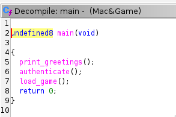
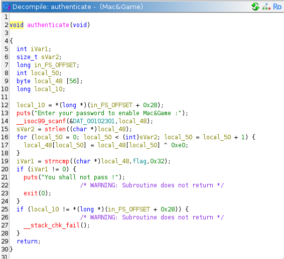
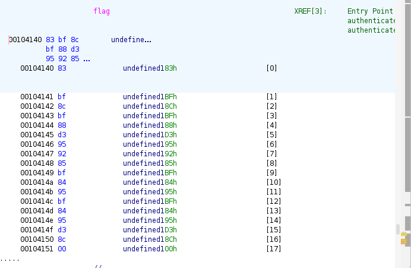
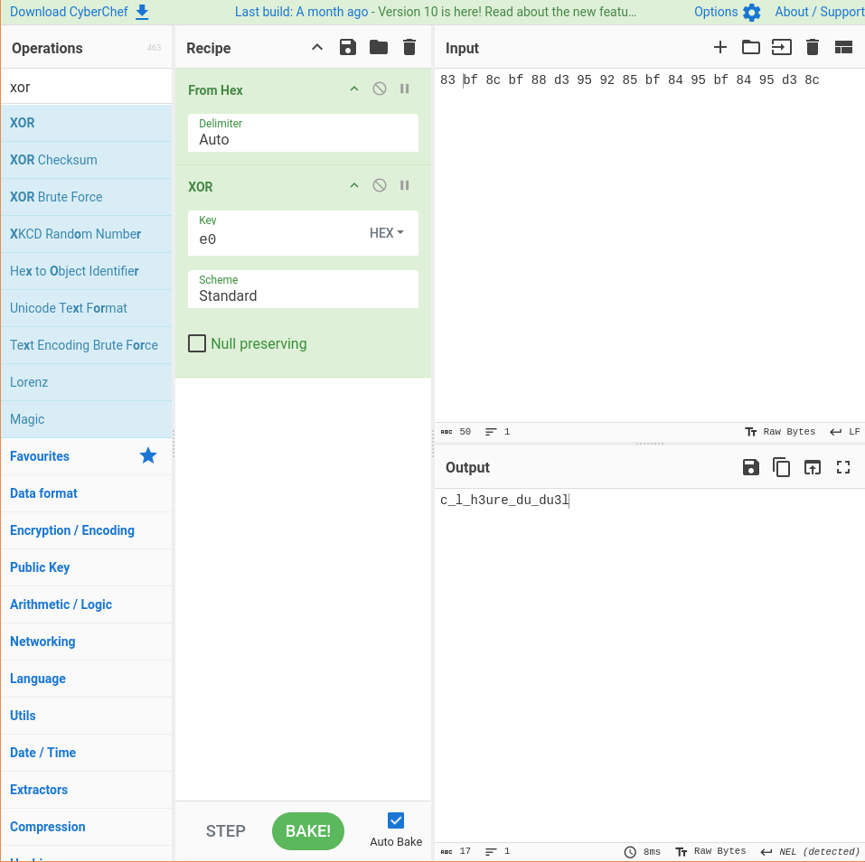

On ne voit rien de particulier dans strings (en tous cas rien qui ne ressemble à un flag), et lorsqu'on lance ltrace sur le binaire on obtient cette partie intéressante qui semble checker notre input :

```
puts("Enter your password to enable Ma"...Enter your password to enable Mac&Game :
)               = 41
__isoc99_scanf(0x5568d5c81301, 0x7ffc55ad4d50, 1, 0x7fecf0b44300azertty
) = 1
strlen("azertty")                                         = 7
strncmp("\201\232\205\222\224\224\231", "\203\277\214\277\210\323\225\222\205\277\204\225\277\204\225\323\214", 50) = -2
puts("You shall not pass !"You shall not pass !
)                              = 21
exit(0 <no return ...>
+++ exited (status 0) +++
```

On voit donc un `strcmp` mais sans aucune des deux chaines de charactère ressemblant à notre input, donc notre input est probablement "cryptée" avant d'être comparée à un flag crypté.

On utilise Ghidra pour analyser statiquement le binaire :



Dans le `main` on voit une fonction `authenticate` que l'on va checker :



On peut ainsi voir que notre input (ici `local_48`) est Xorée par 0xe0, puis comparée à `flag` dans `strcmp`. On regarde alors la valeur de flag :



On utilise CyberChef pour le décryter et obtenir le flag :


