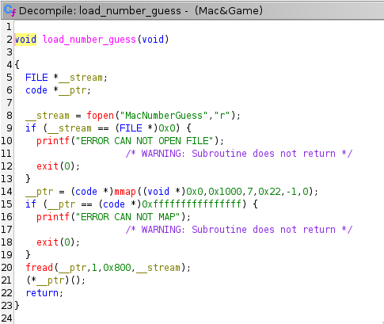

Pour ce challenge, on a pas beaucoup d'informations, apparemment cette chaine doit quand même détenir du code. On observe déja comment le Mac&Games le lance :



Tout ce que fait le programme est de copier le fichier dans un emplacement mémoire avec RWX comme permissions puis l'exécute.

L'utilisation de ltrace ne nous avance à rien car MacNumberGuess n'utilise pas d'appelle à la libc, il ne semble pas non plus linké statiquement (petite taille) et strace nous montre seulement ce qu'on peut deviner, c'est à dire des appels system à read et write. On va devoir debug pour voir ce qui se cache derrière, pour ça on va utiliser GDB, lancer Mac&Games, mettre un break point juste avant l'exécution de MacNumberGuess dans la fonction load_number_guess. En désassemblant on obtient cette première partie code (1618 est la taille du fichier MacNumberGuess) :

```
pwndbg> disass $pc, $pc + 1618
Dump of assembler code from 0x7f3fd7f2f000 to 0x7f3fd7f2f652:
=> 0x00007f3fd7f2f000:	push   rdi
   0x00007f3fd7f2f001:	push   rsp
   0x00007f3fd7f2f002:	pop    rcx
   0x00007f3fd7f2f003:	xor    rdi,QWORD PTR [rcx]
   0x00007f3fd7f2f006:	pop    rcx
   0x00007f3fd7f2f007:	push   0x33
   0x00007f3fd7f2f009:	push   rsp
   0x00007f3fd7f2f00a:	pop    rcx
   0x00007f3fd7f2f00b:	imul   di,WORD PTR [rcx],0x6d57
   0x00007f3fd7f2f010:	push   rdi
   0x00007f3fd7f2f011:	pop    rdx
   0x00007f3fd7f2f012:	push   0x38
   0x00007f3fd7f2f014:	push   rsp
   0x00007f3fd7f2f015:	pop    rcx
   0x00007f3fd7f2f016:	imul   di,WORD PTR [rcx],0x424a
   0x00007f3fd7f2f01b:	push   rdi
   0x00007f3fd7f2f01c:	pop    r8
   0x00007f3fd7f2f01e:	push   0x4b
   0x00007f3fd7f2f020:	push   rsp
   0x00007f3fd7f2f021:	pop    rcx
   0x00007f3fd7f2f022:	imul   di,WORD PTR [rcx],0x436b
   0x00007f3fd7f2f027:	push   rdi
   0x00007f3fd7f2f028:	pop    r9
   0x00007f3fd7f2f02a:	push   0x43
   0x00007f3fd7f2f02c:	push   rsp
   0x00007f3fd7f2f02d:	pop    rcx
   0x00007f3fd7f2f02e:	imul   di,WORD PTR [rcx],0x6933
   0x00007f3fd7f2f033:	push   rdi
   0x00007f3fd7f2f034:	pop    r10
   0x00007f3fd7f2f036:	push   0x6b
   0x00007f3fd7f2f038:	push   rsp
   0x00007f3fd7f2f039:	pop    rcx
   0x00007f3fd7f2f03a:	imul   di,WORD PTR [rcx],0x6951
   0x00007f3fd7f2f03f:	xor    BYTE PTR [rax+rdi*1+0x30],dh
   0x00007f3fd7f2f043:	xor    BYTE PTR [rax+rdi*1+0x33],dh
   0x00007f3fd7f2f047:	xor    BYTE PTR [rax+rdi*1+0x36],dh
   0x00007f3fd7f2f04b:	xor    BYTE PTR [rax+rdi*1+0x37],dh
   0x00007f3fd7f2f04f:	xor    BYTE PTR [rax+rdi*1+0x41],dl
   0x00007f3fd7f2f053:	xor    BYTE PTR [rax+rdi*1+0x43],dh
   0x00007f3fd7f2f057:	xor    BYTE PTR [rax+rdi*1+0x46],dl
   0x00007f3fd7f2f05b:	xor    BYTE PTR [rax+rdi*1+0x47],dh
   0x00007f3fd7f2f05f:	xor    BYTE PTR [rax+rdi*1+0x48],dl
   0x00007f3fd7f2f063:	xor    BYTE PTR [rax+rdi*1+0x49],dl
   0x00007f3fd7f2f067:	xor    BYTE PTR [rax+rdi*1+0x4a],dl
   0x00007f3fd7f2f06b:	xor    BYTE PTR [rax+rdi*1+0x4c],dh
   0x00007f3fd7f2f06f:	xor    BYTE PTR [rax+rdi*1+0x4f],dh
   0x00007f3fd7f2f073:	xor    BYTE PTR [rax+rdi*1+0x56],dl
   0x00007f3fd7f2f077:	xor    BYTE PTR [rax+rdi*1+0x5a],dh
   0x00007f3fd7f2f07b:	xor    BYTE PTR [rax+rdi*1+0x61],dh
   0x00007f3fd7f2f07f:	xor    BYTE PTR [rax+rdi*1+0x62],dl
   0x00007f3fd7f2f083:	xor    BYTE PTR [rax+rdi*1+0x63],dl
   0x00007f3fd7f2f087:	xor    BYTE PTR [rax+rdi*1+0x64],dl
   0x00007f3fd7f2f08b:	xor    BYTE PTR [rax+rdi*1+0x65],dl
   0x00007f3fd7f2f08f:	xor    BYTE PTR [rax+rdi*1+0x66],dh
   0x00007f3fd7f2f093:	xor    BYTE PTR [rax+rdi*1+0x68],dl
   0x00007f3fd7f2f097:	xor    BYTE PTR [rax+rdi*1+0x69],dl
   0x00007f3fd7f2f09b:	xor    BYTE PTR [rax+rdi*1+0x6a],dl
   0x00007f3fd7f2f09f:	xor    BYTE PTR [rax+rdi*1+0x6b],dl
   0x00007f3fd7f2f0a3:	xor    BYTE PTR [rax+rdi*1+0x6c],dl
   0x00007f3fd7f2f0a7:	xor    BYTE PTR [rax+rdi*1+0x6f],dh
   0x00007f3fd7f2f0ab:	xor    BYTE PTR [rax+rdi*1+0x71],dl
   0x00007f3fd7f2f0af:	xor    BYTE PTR [rax+rdi*1+0x72],dh
   0x00007f3fd7f2f0b3:	xor    BYTE PTR [rax+rdi*1+0x73],dl
   0x00007f3fd7f2f0b7:	xor    BYTE PTR [rax+rdi*1+0x74],dl
   0x00007f3fd7f2f0bb:	xor    BYTE PTR [rax+rdi*1+0x75],dl
   0x00007f3fd7f2f0bf:	xor    BYTE PTR [rax+rdi*1+0x76],dl
   0x00007f3fd7f2f0c3:	xor    BYTE PTR [rax+rdi*1+0x77],dh
   0x00007f3fd7f2f0c7:	xor    BYTE PTR [rax+rdi*1+0x78],dl
   0x00007f3fd7f2f0cb:	xor    BYTE PTR [rax+rdi*1+0x79],dl
   0x00007f3fd7f2f0cf:	xor    BYTE PTR [rax+rdi*1+0x7a],dl
   0x00007f3fd7f2f0d3:	push   rdx
   0x00007f3fd7f2f0d4:	push   r8
   0x00007f3fd7f2f0d6:	pop    rdx
   0x00007f3fd7f2f0d7:	xor    BYTE PTR [rax+rdi*1+0x35],dh
   0x00007f3fd7f2f0db:	xor    BYTE PTR [rax+rdi*1+0x4d],dh
   0x00007f3fd7f2f0df:	xor    BYTE PTR [rax+rdi*1+0x67],dl
   0x00007f3fd7f2f0e3:	xor    BYTE PTR [rax+rdi*1+0x6d],dl
   0x00007f3fd7f2f0e7:	xor    BYTE PTR [rax+rdi*1+0x70],dh
   0x00007f3fd7f2f0eb:	pop    rdx
   0x00007f3fd7f2f0ec:	push   rdx
   0x00007f3fd7f2f0ed:	push   r9
   0x00007f3fd7f2f0ef:	pop    rdx
   0x00007f3fd7f2f0f0:	xor    BYTE PTR [rax+rdi*1+0x57],dl
   0x00007f3fd7f2f0f4:	pop    rdx
   0x00007f3fd7f2f0f5:	push   rdx
   0x00007f3fd7f2f0f6:	push   r10
   0x00007f3fd7f2f0f8:	pop    rdx
   0x00007f3fd7f2f0f9:	xor    BYTE PTR [rax+rdi*1+0x31],dh
   0x00007f3fd7f2f0fd:	xor    BYTE PTR [rax+rdi*1+0x32],dh
   0x00007f3fd7f2f101:	xor    BYTE PTR [rax+rdi*1+0x34],dh
   0x00007f3fd7f2f105:	xor    BYTE PTR [rax+rdi*1+0x38],dh
   0x00007f3fd7f2f109:	xor    BYTE PTR [rax+rdi*1+0x44],dh
   0x00007f3fd7f2f10d:	pop    rdx
   0x00007f3fd7f2f10e:	push   0x55
   0x00007f3fd7f2f110:	push   rsp
   0x00007f3fd7f2f111:	pop    rcx
   0x00007f3fd7f2f112:	imul   di,WORD PTR [rcx],0x4251
   0x00007f3fd7f2f117:	xor    BYTE PTR [rax+rdi*1+0x30],dh
   0x00007f3fd7f2f11b:	xor    BYTE PTR [rax+rdi*1+0x33],dl
   0x00007f3fd7f2f11f:	xor    BYTE PTR [rax+rdi*1+0x35],dl
   0x00007f3fd7f2f123:	xor    BYTE PTR [rax+rdi*1+0x36],dl
```

Ça ressemble à des opération de décryptage parce que il y a beacoup de XOR et aussi que RAX contient l'adresse du code que l'on exécute actuellement (le call de MacNumberGuess se fait en faisant `call rax`). On avance jusqu'au maximum où les instructions sembles être valides, on obtient le code suivant que l'on va analyser (à première vu on a les syscalls) :

```
pwndbg> disass $pc, $pc + 1000
Dump of assembler code from 0x7f3fd7f2f50a to 0x7f3fd7f2f8f2:
=> 0x00007f3fd7f2f50a:	movabs r8,0xdeadbeefdeadc0de
   0x00007f3fd7f2f514:	mov    rax,r8
   0x00007f3fd7f2f517:	add    rax,0x309
   0x00007f3fd7f2f51d:	mov    r8,rax
   0x00007f3fd7f2f520:	and    rax,0xff
   0x00007f3fd7f2f526:	mov    r9,rax
   0x00007f3fd7f2f529:	movabs rsi,0xa3a7265626d756e
   0x00007f3fd7f2f533:	push   rsi
   0x00007f3fd7f2f534:	mov    rsi,rsp
   0x00007f3fd7f2f537:	mov    eax,0x1
   0x00007f3fd7f2f53c:	mov    edi,0x1
   0x00007f3fd7f2f541:	mov    edx,0x8
   0x00007f3fd7f2f546:	syscall
   0x00007f3fd7f2f548:	pop    rsi
   0x00007f3fd7f2f549:	sub    rsp,0x5
   0x00007f3fd7f2f54d:	mov    eax,0x0
   0x00007f3fd7f2f552:	mov    edi,0x0
   0x00007f3fd7f2f557:	mov    rsi,rsp
   0x00007f3fd7f2f55a:	mov    edx,0x5
   0x00007f3fd7f2f55f:	syscall
   0x00007f3fd7f2f561:	xor    rax,rax
   0x00007f3fd7f2f564:	xor    rbx,rbx
   0x00007f3fd7f2f567:	mov    bl,BYTE PTR [rsi]
   0x00007f3fd7f2f569:	cmp    bl,0x30
   0x00007f3fd7f2f56c:	jl     0x7f3fd7f2f587
   0x00007f3fd7f2f56e:	cmp    bl,0x39
   0x00007f3fd7f2f571:	jg     0x7f3fd7f2f587
   0x00007f3fd7f2f573:	sub    bl,0x30
   0x00007f3fd7f2f576:	mov    edx,0xa
   0x00007f3fd7f2f57b:	mul    rdx
   0x00007f3fd7f2f57e:	add    rax,rbx
   0x00007f3fd7f2f581:	add    rsi,0x1
   0x00007f3fd7f2f585:	jmp    0x7f3fd7f2f564
   0x00007f3fd7f2f587:	add    rsp,0x5
   0x00007f3fd7f2f58b:	mov    rcx,r9
   0x00007f3fd7f2f58e:	cmp    rcx,rax
   0x00007f3fd7f2f591:	jg     0x7f3fd7f2f59a
   0x00007f3fd7f2f593:	cmp    rcx,rax
   0x00007f3fd7f2f596:	jl     0x7f3fd7f2f5b7
   0x00007f3fd7f2f598:	jmp    0x7f3fd7f2f5d7
   0x00007f3fd7f2f59a:	mov    esi,0xa2b
   0x00007f3fd7f2f59f:	push   rsi
   0x00007f3fd7f2f5a0:	mov    rsi,rsp
   0x00007f3fd7f2f5a3:	mov    eax,0x1
   0x00007f3fd7f2f5a8:	mov    edi,0x1
   0x00007f3fd7f2f5ad:	mov    edx,0x2
   0x00007f3fd7f2f5b2:	syscall
   0x00007f3fd7f2f5b4:	pop    rsi
   0x00007f3fd7f2f5b5:	jmp    0x7f3fd7f2f549
   0x00007f3fd7f2f5b7:	mov    esi,0xa2d
   0x00007f3fd7f2f5bc:	push   rsi
   0x00007f3fd7f2f5bd:	mov    rsi,rsp
   0x00007f3fd7f2f5c0:	mov    eax,0x1
   0x00007f3fd7f2f5c5:	mov    edi,0x1
   0x00007f3fd7f2f5ca:	mov    edx,0x2
   0x00007f3fd7f2f5cf:	syscall
   0x00007f3fd7f2f5d1:	pop    rsi
   0x00007f3fd7f2f5d2:	jmp    0x7f3fd7f2f549
   0x00007f3fd7f2f5d7:	mov    esi,0xa6e6977
   0x00007f3fd7f2f5dc:	push   rsi
   0x00007f3fd7f2f5dd:	mov    rsi,rsp
   0x00007f3fd7f2f5e0:	mov    eax,0x1
   0x00007f3fd7f2f5e5:	mov    edi,0x1
   0x00007f3fd7f2f5ea:	mov    edx,0x4
   0x00007f3fd7f2f5ef:	syscall
   0x00007f3fd7f2f5f1:	pop    rsi
   0x00007f3fd7f2f5f2:	cmp    r9,0x89
   0x00007f3fd7f2f5f9:	jne    0x7f3fd7f2f514
   0x00007f3fd7f2f5ff:	movabs rsi,0xebccd433d2978226
   0x00007f3fd7f2f609:	movabs rax,0xe1ffe100e1ffe100
   0x00007f3fd7f2f613:	xor    rsi,rax
   0x00007f3fd7f2f616:	push   rsi
   0x00007f3fd7f2f617:	movabs rsi,0x82cb8c5f95cf8f5f
   0x00007f3fd7f2f621:	movabs rax,0xe1ffe100e1ffe100
   0x00007f3fd7f2f62b:	xor    rsi,rax
   0x00007f3fd7f2f62e:	push   rsi
   0x00007f3fd7f2f62f:	mov    rsi,rsp
   0x00007f3fd7f2f632:	mov    eax,0x1
   0x00007f3fd7f2f637:	mov    edi,0x1
   0x00007f3fd7f2f63c:	mov    edx,0x10
   0x00007f3fd7f2f641:	syscall
   0x00007f3fd7f2f643:	pop    rsi
   0x00007f3fd7f2f644:	pop    rsi
   0x00007f3fd7f2f645:	mov    eax,0x3c
   0x00007f3fd7f2f64a:	mov    edi,0x0
   0x00007f3fd7f2f64f:	syscall
```

Le premier syscall est un write (on repère les syscall au nombre stocké dans RAX, cf. https://x64.syscall.sh/) qui écrit : "number:\n" (chaine stocké à l'adresse pointé par RSI).

Ensuite le deuxième syscall lit jusqu'à 5 charactère.

Il fait une comparaison pour vérifier que l'input soit entre 0x30 et 0x39 (ascii "0" à "9", on suppose que ça chèque l'entrée, étant donné que le programme demande seulement des entiers). On peut voir qu'il fait une boucle quand il s'agit de chiffre avec `0x00007f3fd7f2f585:	jmp    0x7f3fd7f2f564`

Ensuite on fait une comparaison entre R9 (une valeur qui est apparemment initilisé au tout début) et RAX qui contient le nombre que l'on a rentré, cette comparaison donne suite à un `jg` ET ensuite un `jl` : surement la compairaison de ce jeu + ou - ! (en effet leur deux destinations font un syscall write qui écrit 2 charactères chacun avant de retourner au début).

On passe à la suite (on prend le jmp) et le programme appel un syscall write qui écrit "win\n" et ensuite fait quelque chose d'étrange qui est de comparer le nombre dans R9 (qui est surement le nombre à deviner) à une valeur constante qui n'a pas vraiment de sens : 0x89 ; si cette comparaison échoue le programme revient au début.

On essaie de voir ce qui se cache après en utilisant la fonction de jump de GDB :

```
pwndbg> jump *   0x7f3fd7f2f5ff
Continuing at 0x7f3fd7f2f5ff.
_n0t_m4c&ch3353
```

Voici le flag !
