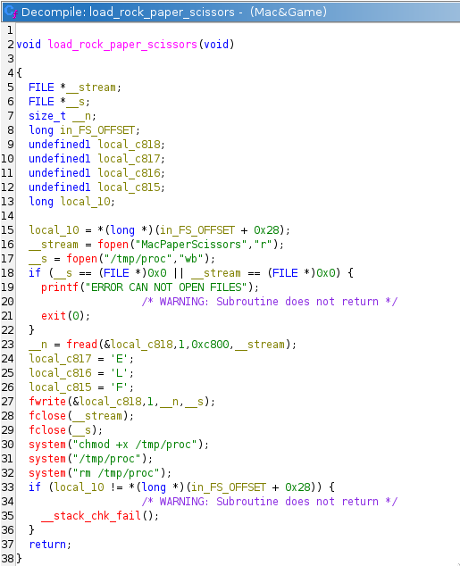
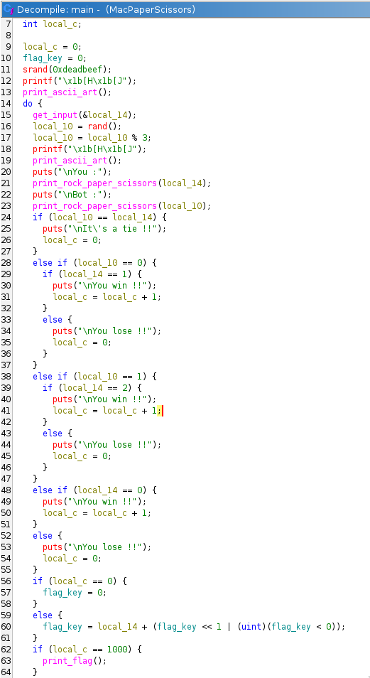
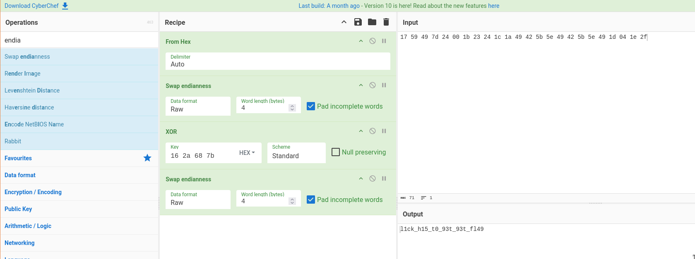

On commence par regarder comment Mac&Games lance le jau car si on essaie de le lancer sans, ça ne reconnait pas le format, on a la décompilation ghidra suivante :



On voit que grosso modo, Mac&Game copie (en modifiant le magic number, c'est la chose qui bloquait l'exécution du programme) MacPaperScissors dans `/tmp` puis le supprime après l'avoir exécuté. On lance donc le programme depuis Mac&Game et on copie le fichier `/tmp/proc` pendant l'exécution.

Une fois copié, on analyse le programme que l'on obtient dans Ghidra parce que le premier coup d'oeil avec `strings` et `ltrace` (à part l'utilisation de `srand` et `rand`).



On voit les choses suivantes :
- initialisation du rand avec une constante : `srand(0xdeadbeef);`
- le "move" du robot : `local_10` qui est soit 0,1 ou 2
- On a l'input : `local_14`
- quand on "win" on incrémente un compteur `local_c` et on calcul au fur et à mesure une clef : `flag_key = local_14 + (flag_key << 1 | (uint)(flag_key < 0));`
- quand on regarde `print_flag` on voit que le flag est une constante qui est xorée avec la clef 32 bits (label `flag`): 17 59 49 7d 24 00 1b 23 24 1c 1a 49 42 5b 5e 49 42 5b 5e 49 1d 04 1e 2f

On va donc essayer de générer la clef avec ce code C :

```c
#include<stdlib.h>
#include<stdio.h>
#include<stdint.h>

#define ROCK 0
#define PAPER 1
#define SCISSORS 2

int main(){
    uint32_t gen_key = 0;
    int res = 0;
    srand(0xDEADBEEF);
    for(int i=0; i<1000;i++){
        res = rand()%3;
        switch (res) {
        case ROCK:
                res = PAPER;
                break;
            case PAPER:
                res= SCISSORS;
                break;
            case SCISSORS:
                res = ROCK;
                break;
            default:
                printf("erreur");
                break;
        }
        gen_key = ((gen_key << 1)|(gen_key >> 31)) + res;
    }
    printf("key : %x\n", gen_key);
    return 0;
}
```

On le compile et on le lance :

```
[Jun 18, 2025 - 00:37:20 (CEST)] exegol-moij /workspace # gcc solv.c
[Jun 18, 2025 - 00:38:05 (CEST)] exegol-moij /workspace # ./a.out
key : 162a687b
```

On utilise CyberChef et on obtient le flag :


